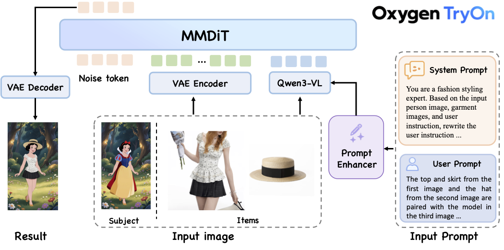
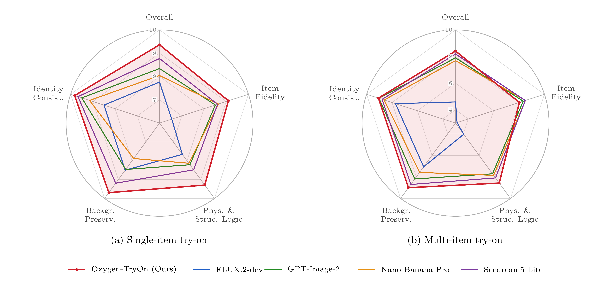

<p align="center">
  
</p>

<h3 align="center">A Fashion-Native Foundation Model for Any-item 

Virtual Try-On</h3>

<div align="center">

[](https://oxygenvision.github.io/Oxygen-TryOn/)
[](https://github.com/OxygenVision/Oxygen-TryOn)
[](https://arxiv.org/abs/2607.21694)

<em>Oxygen AIGC Group & Joy Future Academy, JD</em>

</div>

---

<p align="center">
  
</p>
<p align="center"><sub><em>Any-item virtual try-on across diverse garments, poses, and real-world scenes.</em></sub></p>

## 🔍 Overview

We present Oxygen-TryOn, a unified foundation model for any-item virtual try-on. Rather than repurposing a general-purpose image editor, Oxygen-TryOn is fashion-native, built for try-on through a dedicated data engine and try-on-specific training. Given one or more reference items (clean product shots or in-the-wild worn-on photos) and a single target subject image, it synthesizes a photorealistic image of the subject wearing the items across virtually any fashion category. Prior systems handle a single garment category in a studio setting, and recent multi-reference methods remain garment-centric; in contrast, Oxygen-TryOn supports diverse items and scenarios, including full- and half-body views, a variable number of references, and free multi-item composition, while faithfully preserving both subject identity and item appearance. Instead of mask-based inpainting, we reformulate try-on as a multi-reference, understanding-driven generation task. We build a data engine that collects, manufactures, annotates, and filters high-quality try-on data at scale, and design a three-stage recipe of continued pre-training (CPT), supervised fine-tuning (SFT), and reinforcement learning (RL). The RL stage uses a hybrid reward combining an in-house try-on reward model with a proprietary, rubric-guided general-purpose model, jointly supervising fine-grained consistency and instruction-level quality. It also follows general editing instructions (e.g., pose changes) in the same pass. Across public benchmarks and our in-house Oxygen-TryOn Bench, it achieves state-of-the-art consistency and realism on single-item try-on and leads on multi-item try-on, matching or surpassing both leading proprietary systems (Nano Banana Pro, GPT-Image-2, Seedream5 Lite) and open-source models (FLUX.2).

## ✨ Key Features

- 🧥 **Any item, any combination** — garments, outerwear, accessories, shoes, bags, and more; from a single item to free multi-item outfits, with the model resolving layering and occlusion ("OOTD"-style full-outfit composition).
- 🖼️ **Heterogeneous references** — accepts both clean product shots and in-the-wild worn-on photos; full- or half-body subjects with a variable number of references.
- 🧍 **Faithful preservation** — keeps both the subject's identity and the referenced items' appearance intact.
- ✏️ **Built-in editing** — general instruction-based edits (e.g., pose change) within the same generation pass, with no second model or pass.
- 🎭 **Cross-domain generalization** — even dresses stylized 3D avatars, illustrated characters, statues, or posters while respecting the original style and geometry.
- 🏆 **State-of-the-art** single-item consistency & realism, surpassing strong proprietary systems (Nano Banana Pro, GPT-Image-2, Seedream5 Lite) and leading open-source models (FLUX.2).


## 🗺️ Roadmap

- [x] Technical report
- [x] Online demo
- [ ] Inference code
- [ ] Model weights


## 🧠 Model

<p align="center">
  
</p>
<p align="center"><sub><em><strong>Overall architecture of Oxygen-TryOn.</strong></em></sub></p>

Oxygen-TryOn is built on the JoyAI-Image-Edit foundation and inherits its pretrained weights, coupling a Multimodal Large Language Model (MLLM, Qwen3-VL-8B), a Variational Autoencoder (VAE, Wan-2.1), and a dual-stream Multimodal Diffusion Transformer (MMDiT).

For virtual try-on, the MLLM jointly encodes the target model image, an arbitrary number of reference item images, and the textual wearing instruction into a stream of *semantic condition tokens*, while the VAE encodes the reference and target images into *latent image tokens*. The MMDiT fuses both streams together with noise tokens under timestep conditioning to synthesize the dressed result, which the VAE decoder maps back to pixels.

The reference set is variable in length, enabling single- and multi-item try-on, and the instruction may additionally carry general editing directives (e.g., a pose change).

## 📊 Performance

<p align="center">
  
</p>
<p align="center"><sub><em>Per-dimension VLM-judge scores on TStars-VTON — Oxygen-TryOn (red) holds the most balanced, leading profile for both single- and multi-item try-on.</em></sub></p>

Oxygen-TryOn sets a new state of the art for open-source try-on:

- **TStars-VTON (single-item).** Leads on *every* dimension — overall quality, identity consistency, item fidelity, background preservation, and physical/structural plausibility — surpassing strong proprietary systems (GPT-Image-2, Nano Banana Pro, Seedream5 Lite) and the best open-source model (FLUX.2), as shown above.
- **DressCode & VITON-HD (paired reconstruction).** Improves on the strongest specialist baseline (FastFit) across FID / KID / SSIM / LPIPS.
- **Oxygen-TryOn Bench (in-the-wild).** Achieves the highest share of *directly shippable* results among all models — detailed below.

### In-the-Wild Usability — Oxygen-TryOn Bench

Our deployment benchmark of 1,000 real-world samples, judged by GPT-5 on a 1–5 scale. **Usability Rate** is the share of results whose identity, garment, and image quality are *all* good enough to ship directly. C2M uses clean product-shot references; M2M uses in-the-wild worn-on references.

| Method | C2M Overall | C2M Usability % | M2M Overall | M2M Usability % |
|---|:---:|:---:|:---:|:---:|
| *Open-source* | | | | |
| FastFit | 3.027 | 34.96 | 2.923 | 25.51 |
| Qwen-Image-Edit-2511 | 3.194 | 53.18 | 3.144 | 55.90 |
| FireRed-Image-Edit1.1 | 3.332 | 64.28 | 3.248 | 63.31 |
| FLUX.2-dev | 3.367 | 67.48 | 3.306 | 68.43 |
| *Closed-source* | | | | |
| Nano Banana Pro | 3.431 | 70.16 | 3.539 | 73.18 |
| Seedream5 Lite | 3.507 | 77.67 | 3.428 | 74.70 |
| GPT-Image-2 | 3.532 | 80.35 | 3.542 | 77.58 |
| **Oxygen-TryOn (Ours)** | **3.575** | **86.79** | **3.656** | **85.43** |

Oxygen-TryOn reaches **86.79%** (C2M) and **85.43%** (M2M) usability — clearly ahead of the strongest proprietary system, GPT-Image-2 (80.35% / 77.58%). Full tables across all four benchmarks are available in the technical report.


## 📌 Citation

If you find Oxygen-TryOn useful, please cite:

```bibtex
@article{liu2026oxygen,
  title={Oxygen-TryOn: Fashion-Native Foundation Model for Any-item Virtual Try-On},
  author={Liu, Yong and Fu, Xiaolong and Xu, Zihang and Xue, Wen and Li, Xueheng and Song, Lin and Zhang, Yuan and Zhao, Chuyang and Huang, Haoyang and Duan, Nan and others},
  journal={arXiv preprint arXiv:2607.21694},
  year={2026}
}
```
